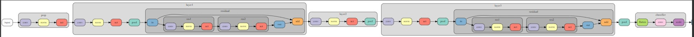
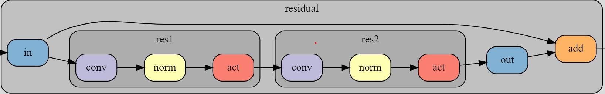
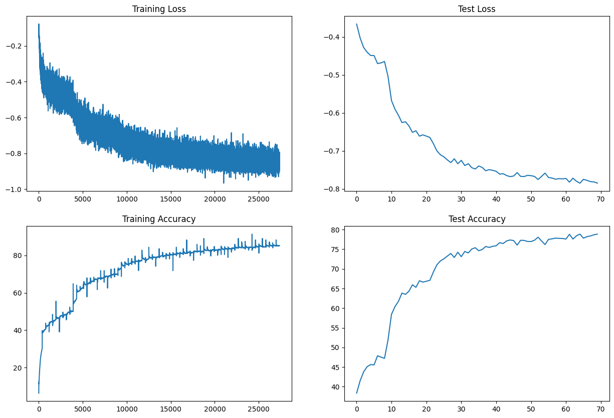
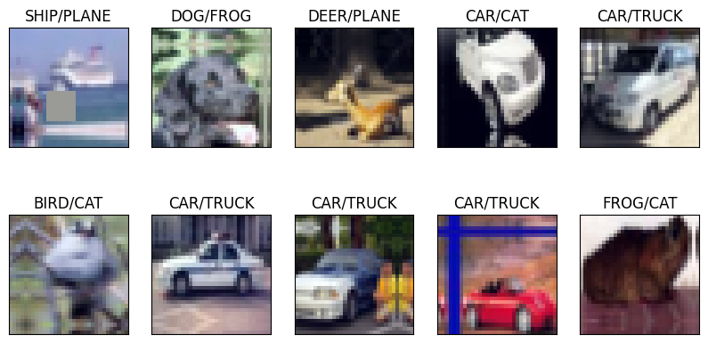

# ERA-V1-Assignments for Session 10
This repository contains all the ERA V1 session 10 Assignments.

In this assignment for session 10, we are building a model to classify the CIFAR 10 dataset using our custom model.

## Model Architecture
Custom ResNet architecture for CIFAR10:

### Basic Block Architecture

### Training logs

<h3>Training Logs</h3>

EPOCH: 0
Loss=-0.7389600276947021 Batch_id=390 Accuracy=69.34: 100%|██████████| 391/391 [00:26<00:00, 14.69it/s]

Test set: Average loss: -0.6612, Accuracy: 6685/10000 (66.85%)

EPOCH: 1
Loss=-0.7107889652252197 Batch_id=390 Accuracy=69.76: 100%|██████████| 391/391 [00:26<00:00, 14.62it/s]

Test set: Average loss: -0.6647, Accuracy: 6709/10000 (67.09%)

EPOCH: 2
Loss=-0.6206892132759094 Batch_id=390 Accuracy=70.19: 100%|██████████| 391/391 [00:26<00:00, 14.72it/s]

Test set: Average loss: -0.6809, Accuracy: 6919/10000 (69.19%)

EPOCH: 3
Loss=-0.7633108496665955 Batch_id=390 Accuracy=73.18: 100%|██████████| 391/391 [00:26<00:00, 14.79it/s]

Test set: Average loss: -0.6998, Accuracy: 7102/10000 (71.02%)

EPOCH: 4
Loss=-0.7866025567054749 Batch_id=390 Accuracy=74.44: 100%|██████████| 391/391 [00:26<00:00, 15.00it/s]

Test set: Average loss: -0.7101, Accuracy: 7201/10000 (72.01%)

EPOCH: 5
Loss=-0.7438679933547974 Batch_id=390 Accuracy=75.18: 100%|██████████| 391/391 [00:26<00:00, 14.80it/s]

Test set: Average loss: -0.7156, Accuracy: 7257/10000 (72.57%)

EPOCH: 6
Loss=-0.6571382284164429 Batch_id=390 Accuracy=75.85: 100%|██████████| 391/391 [00:25<00:00, 15.26it/s]

Test set: Average loss: -0.7236, Accuracy: 7325/10000 (73.25%)

EPOCH: 7
Loss=-0.7576932311058044 Batch_id=390 Accuracy=76.40: 100%|██████████| 391/391 [00:25<00:00, 15.33it/s]

Test set: Average loss: -0.7309, Accuracy: 7394/10000 (73.94%)

EPOCH: 8
Loss=-0.8383808135986328 Batch_id=390 Accuracy=76.94: 100%|██████████| 391/391 [00:25<00:00, 15.08it/s]

Test set: Average loss: -0.7209, Accuracy: 7290/10000 (72.90%)

EPOCH: 9
Loss=-0.7055581212043762 Batch_id=390 Accuracy=77.33: 100%|██████████| 391/391 [00:25<00:00, 15.31it/s]

Test set: Average loss: -0.7338, Accuracy: 7424/10000 (74.24%)

EPOCH: 10
Loss=-0.749611496925354 Batch_id=390 Accuracy=77.73: 100%|██████████| 391/391 [00:26<00:00, 15.03it/s]

Test set: Average loss: -0.7249, Accuracy: 7311/10000 (73.11%)

EPOCH: 11
Loss=-0.8085075616836548 Batch_id=390 Accuracy=78.18: 100%|██████████| 391/391 [00:26<00:00, 14.73it/s]

Test set: Average loss: -0.7385, Accuracy: 7444/10000 (74.44%)

EPOCH: 12
Loss=-0.7476736307144165 Batch_id=390 Accuracy=78.63: 100%|██████████| 391/391 [00:25<00:00, 15.17it/s]

Test set: Average loss: -0.7337, Accuracy: 7407/10000 (74.07%)

EPOCH: 13
Loss=-0.7708432078361511 Batch_id=390 Accuracy=78.93: 100%|██████████| 391/391 [00:24<00:00, 15.74it/s]

Test set: Average loss: -0.7442, Accuracy: 7506/10000 (75.06%)

EPOCH: 14
Loss=-0.7594772577285767 Batch_id=390 Accuracy=79.15: 100%|██████████| 391/391 [00:25<00:00, 15.64it/s]

Test set: Average loss: -0.7477, Accuracy: 7539/10000 (75.39%)

EPOCH: 15
Loss=-0.7984191179275513 Batch_id=390 Accuracy=79.66: 100%|██████████| 391/391 [00:25<00:00, 15.11it/s]

Test set: Average loss: -0.7397, Accuracy: 7462/10000 (74.62%)

EPOCH: 16
Loss=-0.8333936929702759 Batch_id=390 Accuracy=79.85: 100%|██████████| 391/391 [00:25<00:00, 15.05it/s]

Test set: Average loss: -0.7436, Accuracy: 7494/10000 (74.94%)

EPOCH: 17
Loss=-0.7721295952796936 Batch_id=390 Accuracy=79.99: 100%|██████████| 391/391 [00:25<00:00, 15.49it/s]

Test set: Average loss: -0.7523, Accuracy: 7570/10000 (75.70%)

EPOCH: 18
Loss=-0.8184776306152344 Batch_id=390 Accuracy=80.34: 100%|██████████| 391/391 [00:26<00:00, 14.80it/s]

Test set: Average loss: -0.7493, Accuracy: 7546/10000 (75.46%)

EPOCH: 19
Loss=-0.7825815677642822 Batch_id=390 Accuracy=80.59: 100%|██████████| 391/391 [00:25<00:00, 15.64it/s]

Test set: Average loss: -0.7511, Accuracy: 7574/10000 (75.74%)

EPOCH: 20
Loss=-0.7235853672027588 Batch_id=390 Accuracy=80.94: 100%|██████████| 391/391 [00:25<00:00, 15.60it/s]

Test set: Average loss: -0.7538, Accuracy: 7589/10000 (75.89%)

EPOCH: 21
Loss=-0.8276389241218567 Batch_id=390 Accuracy=81.05: 100%|██████████| 391/391 [00:25<00:00, 15.50it/s]

Test set: Average loss: -0.7613, Accuracy: 7668/10000 (76.68%)

EPOCH: 22
Loss=-0.7769805192947388 Batch_id=390 Accuracy=81.29: 100%|██████████| 391/391 [00:25<00:00, 15.58it/s]

Test set: Average loss: -0.7599, Accuracy: 7646/10000 (76.46%)

EPOCH: 23
Loss=-0.7154543995857239 Batch_id=390 Accuracy=81.39: 100%|██████████| 391/391 [00:25<00:00, 15.41it/s]

Test set: Average loss: -0.7649, Accuracy: 7713/10000 (77.13%)

EPOCH: 24
Loss=-0.7928584814071655 Batch_id=390 Accuracy=81.47: 100%|██████████| 391/391 [00:25<00:00, 15.41it/s]

Test set: Average loss: -0.7677, Accuracy: 7736/10000 (77.36%)

EPOCH: 25
Loss=-0.8659998774528503 Batch_id=390 Accuracy=81.93: 100%|██████████| 391/391 [00:26<00:00, 14.94it/s]

Test set: Average loss: -0.7661, Accuracy: 7721/10000 (77.21%)

EPOCH: 26
Loss=-0.7034163475036621 Batch_id=390 Accuracy=82.02: 100%|██████████| 391/391 [00:24<00:00, 16.03it/s]

Test set: Average loss: -0.7570, Accuracy: 7606/10000 (76.06%)

EPOCH: 27
Loss=-0.8797570466995239 Batch_id=390 Accuracy=82.25: 100%|██████████| 391/391 [00:24<00:00, 16.20it/s]

Test set: Average loss: -0.7670, Accuracy: 7728/10000 (77.28%)

EPOCH: 28
Loss=-0.8390817642211914 Batch_id=390 Accuracy=82.67: 100%|██████████| 391/391 [00:24<00:00, 15.83it/s]

Test set: Average loss: -0.7675, Accuracy: 7725/10000 (77.25%)

EPOCH: 29
Loss=-0.8599830865859985 Batch_id=390 Accuracy=82.45: 100%|██████████| 391/391 [00:24<00:00, 15.71it/s]

Test set: Average loss: -0.7644, Accuracy: 7698/10000 (76.98%)

EPOCH: 30
Loss=-0.9080682992935181 Batch_id=390 Accuracy=82.85: 100%|██████████| 391/391 [00:25<00:00, 15.55it/s]

Test set: Average loss: -0.7652, Accuracy: 7697/10000 (76.97%)

EPOCH: 31
Loss=-0.8512714505195618 Batch_id=390 Accuracy=82.90: 100%|██████████| 391/391 [00:24<00:00, 15.65it/s]

Test set: Average loss: -0.7673, Accuracy: 7730/10000 (77.30%)

EPOCH: 32
Loss=-0.7900488376617432 Batch_id=390 Accuracy=83.11: 100%|██████████| 391/391 [00:26<00:00, 15.01it/s]

Test set: Average loss: -0.7753, Accuracy: 7807/10000 (78.07%)

EPOCH: 33
Loss=-0.8320744633674622 Batch_id=390 Accuracy=83.20: 100%|██████████| 391/391 [00:25<00:00, 15.64it/s]

Test set: Average loss: -0.7673, Accuracy: 7712/10000 (77.12%)

EPOCH: 34
Loss=-0.9007150530815125 Batch_id=390 Accuracy=83.38: 100%|██████████| 391/391 [00:24<00:00, 15.71it/s]

Test set: Average loss: -0.7584, Accuracy: 7619/10000 (76.19%)

EPOCH: 35
Loss=-0.6846899390220642 Batch_id=390 Accuracy=83.48: 100%|██████████| 391/391 [00:25<00:00, 15.61it/s]

Test set: Average loss: -0.7699, Accuracy: 7752/10000 (77.52%)

EPOCH: 36
Loss=-0.8914202451705933 Batch_id=390 Accuracy=83.72: 100%|██████████| 391/391 [00:25<00:00, 15.59it/s]

Test set: Average loss: -0.7715, Accuracy: 7765/10000 (77.65%)

EPOCH: 37
Loss=-0.8624817132949829 Batch_id=390 Accuracy=83.88: 100%|██████████| 391/391 [00:25<00:00, 15.58it/s]

Test set: Average loss: -0.7745, Accuracy: 7783/10000 (77.83%)

EPOCH: 38
Loss=-0.8644660115242004 Batch_id=390 Accuracy=84.05: 100%|██████████| 391/391 [00:24<00:00, 15.68it/s]

Test set: Average loss: -0.7730, Accuracy: 7777/10000 (77.77%)

EPOCH: 39
Loss=-0.8264861106872559 Batch_id=390 Accuracy=84.15: 100%|██████████| 391/391 [00:26<00:00, 14.70it/s]

Test set: Average loss: -0.7736, Accuracy: 7774/10000 (77.74%)

EPOCH: 40
Loss=-0.7361206412315369 Batch_id=390 Accuracy=84.13: 100%|██████████| 391/391 [00:25<00:00, 15.22it/s]

Test set: Average loss: -0.7725, Accuracy: 7760/10000 (77.60%)

EPOCH: 41
Loss=-0.8082645535469055 Batch_id=390 Accuracy=84.47: 100%|██████████| 391/391 [00:25<00:00, 15.26it/s]

Test set: Average loss: -0.7823, Accuracy: 7881/10000 (78.81%)

EPOCH: 42
Loss=-0.8625292778015137 Batch_id=390 Accuracy=84.62: 100%|██████████| 391/391 [00:25<00:00, 15.15it/s]

Test set: Average loss: -0.7719, Accuracy: 7759/10000 (77.59%)

EPOCH: 43
Loss=-0.7751172780990601 Batch_id=390 Accuracy=84.64: 100%|██████████| 391/391 [00:25<00:00, 15.12it/s]

Test set: Average loss: -0.7797, Accuracy: 7842/10000 (78.42%)

EPOCH: 44
Loss=-0.7496389150619507 Batch_id=390 Accuracy=84.81: 100%|██████████| 391/391 [00:25<00:00, 15.22it/s]

Test set: Average loss: -0.7850, Accuracy: 7886/10000 (78.86%)

EPOCH: 45
Loss=-0.8920868635177612 Batch_id=390 Accuracy=84.69: 100%|██████████| 391/391 [00:25<00:00, 15.38it/s]

Test set: Average loss: -0.7748, Accuracy: 7783/10000 (77.83%)

EPOCH: 46
Loss=-0.7359713315963745 Batch_id=390 Accuracy=84.95: 100%|██████████| 391/391 [00:26<00:00, 14.79it/s]

Test set: Average loss: -0.7774, Accuracy: 7820/10000 (78.20%)

EPOCH: 47
Loss=-0.8377944231033325 Batch_id=390 Accuracy=85.07: 100%|██████████| 391/391 [00:25<00:00, 15.27it/s]

Test set: Average loss: -0.7809, Accuracy: 7839/10000 (78.39%)

EPOCH: 48
Loss=-0.8180767297744751 Batch_id=390 Accuracy=85.20: 100%|██████████| 391/391 [00:26<00:00, 14.83it/s]

Test set: Average loss: -0.7815, Accuracy: 7868/10000 (78.68%)

EPOCH: 49
Loss=-0.8583815693855286 Batch_id=390 Accuracy=85.28: 100%|██████████| 391/391 [00:25<00:00, 15.12it/s]

Test set: Average loss: -0.7848, Accuracy: 7885/10000 (78.85%)

## Training and Testing Loss

## Sample of Misclassified Images

