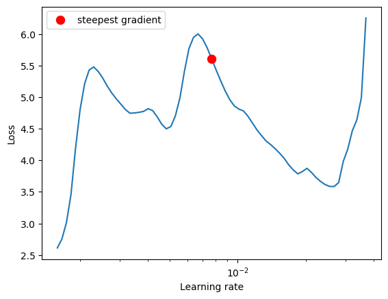

# ERA-V1-Assignments for Session 11
This repository contains all the ERA V1 session 11 Assignments.

In this assignment, we are using a ResNet18 model to classify the CIFAR 10 dataset.
We will be using OneCycleLR to find the best LR and use GradCam to display the misclassified images.

## Model Architecture
We are using the Standard ResNet18 model.

## Package details
We create a package consisting of the below files:

### Models folder
It contains the model.py file. This file contains code for ResNet18.

### Main.py
This contains the main package file which will be called in the jupyter notebook.
It contains the below:
  - training and test loops
  - data split between test and train
  - epochs
  - batch size
  - optimizer

### Utils.py
This contains all the other utility functions like:
  - image transforms using albumentations
  - GradCam
  - Code to view misclassification images with labels

### OneCycle LR

### Training and Testing Accuracy and Losses

### 10 Misclassified Images

### GradCam Images

### Training logs

<h3>Training Logs</h3>

EPOCH: 0
Loss=-8.348092079162598 Batch_id=390 Accuracy=27.22: 100%|██████████| 391/391 [00:47<00:00,  8.29it/s]

Test set: Average loss: -8.9889, Accuracy: 3718/10000 (37.18%)

EPOCH: 1
Loss=-13.658432006835938 Batch_id=390 Accuracy=40.79: 100%|██████████| 391/391 [00:45<00:00,  8.53it/s]

Test set: Average loss: -14.1183, Accuracy: 4674/10000 (46.74%)

EPOCH: 2
Loss=-17.852144241333008 Batch_id=390 Accuracy=47.22: 100%|██████████| 391/391 [00:46<00:00,  8.47it/s]

Test set: Average loss: -18.8614, Accuracy: 5065/10000 (50.65%)

EPOCH: 3
Loss=-20.194150924682617 Batch_id=390 Accuracy=50.90: 100%|██████████| 391/391 [00:46<00:00,  8.48it/s]

Test set: Average loss: -23.5322, Accuracy: 5295/10000 (52.95%)

EPOCH: 4
Loss=-25.949024200439453 Batch_id=390 Accuracy=53.79: 100%|██████████| 391/391 [00:46<00:00,  8.47it/s]

Test set: Average loss: -27.8278, Accuracy: 5529/10000 (55.29%)

EPOCH: 5
Loss=-30.83526611328125 Batch_id=390 Accuracy=55.82: 100%|██████████| 391/391 [00:46<00:00,  8.49it/s]

Test set: Average loss: -31.2832, Accuracy: 5802/10000 (58.02%)

EPOCH: 6
Loss=-33.5245361328125 Batch_id=390 Accuracy=57.52: 100%|██████████| 391/391 [00:45<00:00,  8.51it/s]

Test set: Average loss: -36.9181, Accuracy: 5947/10000 (59.47%)

EPOCH: 7
Loss=-39.903602600097656 Batch_id=390 Accuracy=59.00: 100%|██████████| 391/391 [00:45<00:00,  8.51it/s]

Test set: Average loss: -41.5162, Accuracy: 5965/10000 (59.65%)

EPOCH: 8
Loss=-42.468833923339844 Batch_id=390 Accuracy=60.06: 100%|██████████| 391/391 [00:45<00:00,  8.51it/s]

Test set: Average loss: -45.9304, Accuracy: 6018/10000 (60.18%)

EPOCH: 9
Loss=-49.49666213989258 Batch_id=390 Accuracy=60.98: 100%|██████████| 391/391 [00:45<00:00,  8.51it/s]

Test set: Average loss: -50.7896, Accuracy: 6128/10000 (61.28%)

EPOCH: 10
Loss=-54.692359924316406 Batch_id=390 Accuracy=61.56: 100%|██████████| 391/391 [00:45<00:00,  8.51it/s]

Test set: Average loss: -57.7965, Accuracy: 6265/10000 (62.65%)

EPOCH: 11
Loss=-58.20646286010742 Batch_id=390 Accuracy=62.64: 100%|██████████| 391/391 [00:45<00:00,  8.52it/s]

Test set: Average loss: -63.1021, Accuracy: 6322/10000 (63.22%)

EPOCH: 12
Loss=-66.6490249633789 Batch_id=390 Accuracy=63.19: 100%|██████████| 391/391 [00:45<00:00,  8.54it/s]

Test set: Average loss: -70.2397, Accuracy: 6413/10000 (64.13%)

EPOCH: 13
Loss=-74.10527801513672 Batch_id=390 Accuracy=63.99: 100%|██████████| 391/391 [00:45<00:00,  8.52it/s]

Test set: Average loss: -75.8298, Accuracy: 6379/10000 (63.79%)

EPOCH: 14
Loss=-79.94081115722656 Batch_id=390 Accuracy=64.56: 100%|██████████| 391/391 [00:46<00:00,  8.49it/s]

Test set: Average loss: -82.3945, Accuracy: 6408/10000 (64.08%)

EPOCH: 15
Loss=-89.30684661865234 Batch_id=390 Accuracy=65.00: 100%|██████████| 391/391 [00:46<00:00,  8.50it/s]

Test set: Average loss: -90.2219, Accuracy: 6459/10000 (64.59%)

EPOCH: 16
Loss=-96.66923522949219 Batch_id=390 Accuracy=65.41: 100%|██████████| 391/391 [00:45<00:00,  8.53it/s]

Test set: Average loss: -97.6025, Accuracy: 6542/10000 (65.42%)

EPOCH: 17
Loss=-102.21519470214844 Batch_id=390 Accuracy=66.01: 100%|██████████| 391/391 [00:45<00:00,  8.52it/s]

Test set: Average loss: -103.9684, Accuracy: 6592/10000 (65.92%)

EPOCH: 18
Loss=-113.39399719238281 Batch_id=390 Accuracy=66.55: 100%|██████████| 391/391 [00:45<00:00,  8.54it/s]

Test set: Average loss: -112.6640, Accuracy: 6633/10000 (66.33%)

EPOCH: 19
Loss=-120.7132797241211 Batch_id=390 Accuracy=66.85: 100%|██████████| 391/391 [00:45<00:00,  8.50it/s]

Test set: Average loss: -121.5926, Accuracy: 6581/10000 (65.81%)
