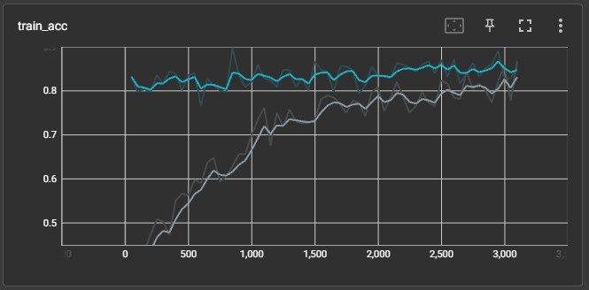
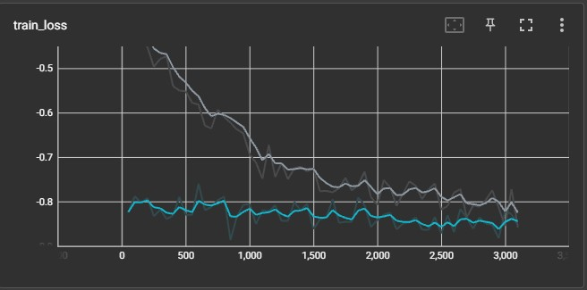
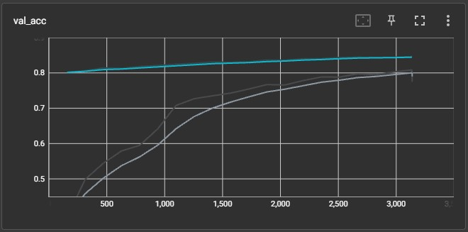
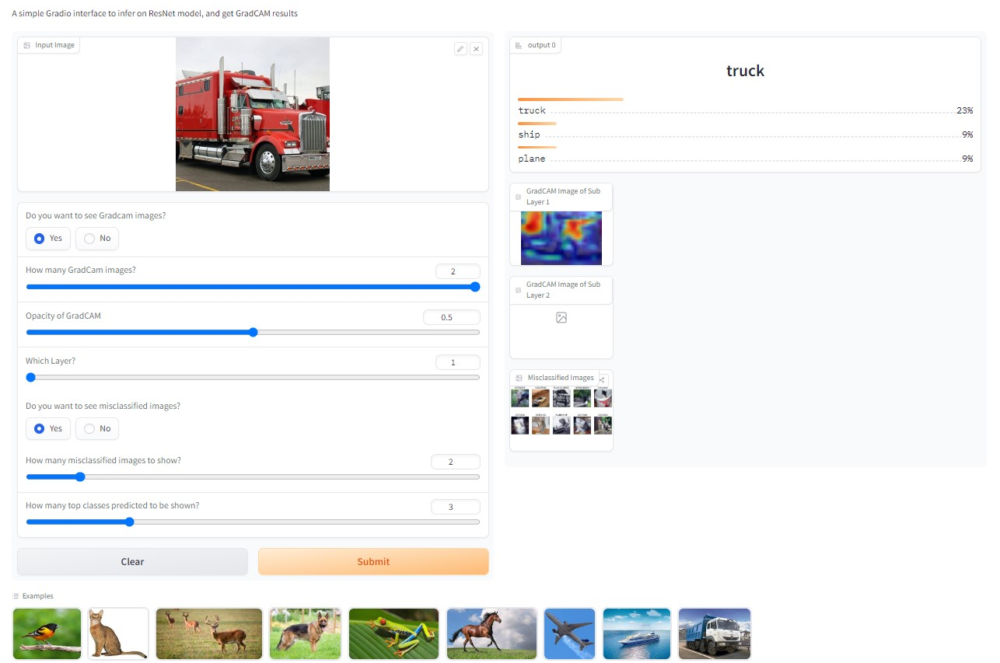

# ERA-V1-Assignments for Session 12
This repository contains all the ERA V1 session 12 Assignments.

In this assignment, we are using Pytorch Lightning to implement ResNet18 model to classify the CIFAR 10 dataset.
Also, we use Gradio to build an interactive UI for testing our model and deploy it on HuggingFace Spaces.

## Model Architecture
We are using the Standard ResNet18 model.

### Training Accuracy

### Training Loss

### Validation Accuracy

### Validation Accuracy

### 10 Misclassified Images

# HuggingFace Spaces link
The app is deployed on HuggingFace Spaces at the below link:
https://huggingface.co/spaces/dknayakbu/ERA_VI_S12_Demo1

