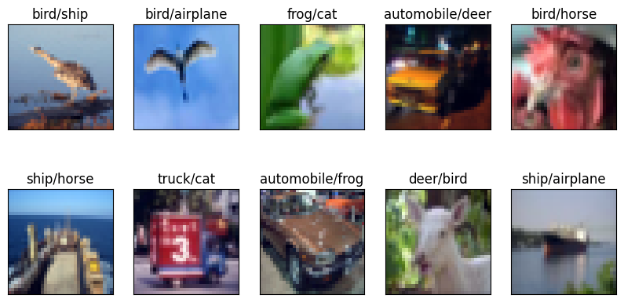

# ERA-V1-Assignments for Session 8
This repository contains all the ERA V1 session 8 Assignments.

In this assignment for session 8, we are building a model to classify the MNIST dataset.

# Code Structure
##

# Train and Test Accuracy Comparision
In our experiment we only change the norlisation technique while keeping all the other parameters constant to see the effects.

Here we can see that only Group Normalisation did not have much overfitting while Batch and Layer Normalisation had a very high difference between train and test accuracies indicating overfitting.

## Using Batch Normalisation
Train Accuracy = 80.03%

Test Accuracy = 69.77%

## Using Group Normalisation
Train Accuracy = 72.64%

Test Accuracy = 70.00%

## Using Layer Normalisation
Train Accuracy = 71.75%

Test Accuracy = 69.29%

# Train and Test Accuracy Variation
Here we visualize the how the training & testing accuracy & loss vary with respect to different normalisation functions.
We can observe from the below images that while all the normalisation techniques result in almost similar test accuracy and loss scores, the Batch normalisation gets slightly better training as well as test accuracy scores.

## Using Batch Normalisation

## Using Group Normalisation

## Using Layer Normalisation

# Misclassified Images samples
Here we visualize the how the misclassified images vary with respect to different normalisation functions.
We can observe here that for Batch Normalisation, the misclassified images are relatively tough to distinguish and the predicted class looks similar to actual class. 

Example: Actual Class-Aeroplane vs Predicted Class-Bird

In similar context for the Layer normalisation, the actual vs predicted classes for misclassified images don't look similar and should have been classified correctly.

## Using Batch Normalisation

## Using Group Normalisation

## Using Layer Normalisation

